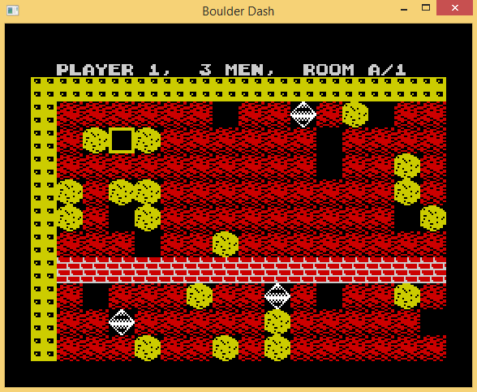

An implementation of [Boulder Dash](http://www.worldofspectrum.org/infoseekid.cgi?id=0000639) (ZX Spectrum version, 1984) written in C for Windows.

A lot of useful information about inner workings of Boulder Dash was taken from http://www.elmerproductions.com/sp/peterb/.

Demo GIF:  


# Changes
Made many changes and switched to just make using my boiler plate make system.

The makefile system is added as a submodule now so remember `git submodule update --init` after clone.

Build on Linux using libsdl2 command
```
make CPU=host
```

Also separated the system specific code into directories host for Linux specific.

 